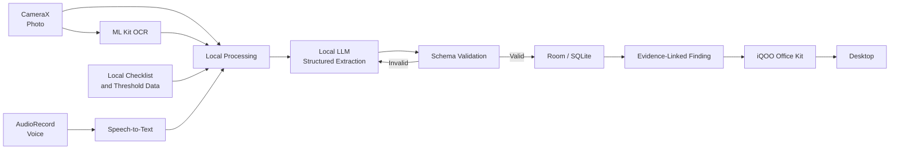

# FieldLens

**Evidence-to-Report AI for Field Work**

> **See it. Say it. Report it.**

FieldLens is an offline-first Android application designed to help field professionals turn on-site observations into structured, traceable reports without depending on a cloud connection.

**Track:** Productivity  
**Event:** iQOO Hackathon 2026 — City Battles  
**Entry:** Solo Thread

---

## Overview

Field work produces useful information in forms that are difficult to organize later: photographs, voice notes, visible labels, and observations made on the spot.

The usual workflow is fragmented:

```text
Field
Photo + Voice Note + Context
          ↓
        Phone
          ↓
      Later at desk
          ↓
Manual report preparation
          ↓
Structured record
````

FieldLens moves the structuring step closer to the point where the information is captured.

```text
Photo + Voice
      ↓
On-device processing
      ↓
Structured finding
      ↓
Evidence-linked review
      ↓
Local storage
      ↓
Desktop handoff
```

The initial MVP focuses on **facility and site defect reporting**.

---

## Problem

A field professional may notice a damaged asset, leak, crack, or other issue and capture the information quickly using a camera and voice note.

The problem begins afterwards.

The evidence is often split across:

* photographs
* audio recordings
* handwritten or remembered context
* separate reporting tools

The final report is then prepared later, often by manually reconciling those pieces.

This creates unnecessary work and makes it easier for important context to become separated from the original evidence.

Connectivity adds another constraint. A cloud-based AI workflow is not always suitable at the point where an observation is made.

**FieldLens focuses on this specific gap: converting field evidence into a structured record while the context is still available and without requiring a cloud connection for the core workflow.**

---

## Solution

The FieldLens workflow starts with two simple inputs:

1. A photograph of the issue
2. A spoken description of the observation

The app processes those inputs on the device and produces a structured finding.

### Example

A user photographs a damaged electrical panel and says:

> "Panel cover is damaged on the lower-right side near the warehouse entrance. Check it before the next shift."

FieldLens can structure the observation as:

```json
{
  "defect_type": "Damaged electrical panel cover",
  "severity": "HIGH",
  "location": "Warehouse entrance",
  "observation": "Cover panel damaged on the lower-right side.",
  "recommended_action": "Inspect and secure panel before the next shift."
}
```

The original photo, audio, and transcript remain associated with the finding.

---

## Evidence-Linked Findings

The central product idea is **traceability**.

FieldLens does not treat the generated report as the final source of truth. Each important field can be connected to the evidence used to produce it.

For example:

```text
Severity: HIGH
      ↓
Supporting evidence
      ├── Original photograph
      └── Spoken observation
```

A reviewer can inspect the supporting evidence instead of having to trust an unexplained AI-generated value.

This creates a clearer distinction between:

* what was observed
* what the model extracted
* what evidence supports the extraction

---

## Workflow

```text
1. Capture
   Photograph the issue and record an observation.

2. Transcribe
   Convert the spoken observation into text locally.

3. Extract
   Read useful text from the image and combine it with the transcript.

4. Structure
   A small local language model fills a predefined report schema.

5. Validate
   Check the generated structure before showing it to the user.

6. Review
   Inspect the finding and its supporting evidence.

7. Save
   Store the record locally.

8. Handoff
   Transfer the completed report and evidence to the desktop through
   iQOO Office Kit.
```

---

## Architecture



---

## Report Model

FieldLens uses a fixed schema rather than asking the language model to write an unrestricted report.

```json
{
  "id": "FINDING-014",
  "timestamp": "2026-09-26T14:32:05+05:30",
  "defect_type": "Damaged electrical panel cover",
  "severity": "HIGH",
  "location": "Warehouse entrance",
  "observation": "Cover panel damaged on the lower-right side.",
  "recommended_action": "Inspect and secure panel before next shift.",
  "evidence": {
    "photo": "evidence/photo_014.jpg",
    "audio": "evidence/voice_014.wav",
    "transcript": "source/transcript_014.txt"
  },
  "field_sources": {
    "severity": [
      "photo_014.jpg",
      "voice_014.wav"
    ],
    "location": [
      "voice_014.wav"
    ],
    "observation": [
      "voice_014.wav",
      "photo_014.jpg"
    ]
  }
}
```

### Why a fixed schema?

A constrained output makes the result easier to:

* validate
* display consistently
* store locally
* transfer to another system
* connect back to source evidence

The model is responsible for **extracting structure**, not producing unrestricted prose.

---

## Technology Stack

| Layer            | Technology                              | Role                        |
| ---------------- | --------------------------------------- | --------------------------- |
| Android          | Kotlin + Jetpack Compose                | Application and UI          |
| Camera           | CameraX                                 | Evidence capture            |
| Speech-to-text   | whisper.cpp                             | Offline voice transcription |
| OCR              | ML Kit On-Device Text Recognition       | Text extraction from images |
| Local AI         | Quantized 1B-class open-source LLM      | Structured extraction       |
| Inference        | MediaPipe LLM Inference API / llama.cpp | Local model execution       |
| Grounding        | Bundled JSON checklists and thresholds  | Local reference context     |
| Storage          | Room / SQLite                           | Offline persistence         |
| Desktop workflow | iQOO Office Kit                         | Clipboard and file handoff  |

> The final local inference backend and hardware delegate will be selected and validated against the event device during implementation.

---

## Design Principles

### 1. Offline-first

The core workflow should not depend on network availability.

```text
Capture
  ↓
Transcribe
  ↓
Extract
  ↓
Validate
  ↓
Save
  ↓
Review
```

The application is designed so that an inspection can continue when connectivity is unavailable.

### 2. Constrained output

The local model works against a predefined schema rather than generating an unrestricted report.

```text
Input
  ↓
Local model
  ↓
Structured JSON
  ↓
Validation
  ↓
User review
```

### 3. Evidence remains attached

Generated information should remain connected to the original media.

That makes the result easier to review and reduces the distance between the AI output and the underlying observation.

### 4. Narrow MVP

FieldLens is intentionally limited to one initial workflow:

**Facility / site defect reporting**

The goal is to make one complete workflow reliable before expanding into additional domains.

---

## Privacy

FieldLens is designed around local processing for the core workflow.

The intended architecture avoids sending the captured field evidence to a remote AI service:

* photo remains local
* voice remains local
* transcription is performed locally
* structured extraction uses a local model
* findings are stored locally

This is particularly relevant for workflows involving sensitive site information or environments with unreliable connectivity.

---

## Field-to-Office Handoff

FieldLens does not stop when the finding is generated.

The completed record can move from the phone to the desktop through iQOO Office Kit.

```text
FIELD
Photo
Voice
Local processing
Structured finding
Evidence
      ↓
iQOO Office Kit
      ↓
DESKTOP
Report + supporting evidence
```

The purpose of this step is to connect field capture with the existing desk-side reporting process.

---

## Reliability Strategy

The live build prioritizes predictable behavior over feature breadth.

### Structured output

Invalid model output is rejected before it reaches the report view.

### Local persistence

Findings are saved locally so they are not dependent on network availability.

### Evidence preservation

The original photo, audio and transcript remain available alongside the generated result.

### Fallbacks

```text
Voice transcription unavailable
        ↓
Typed observation + image evidence

Local model is too slow
        ↓
Use a smaller model / shorter schema

Model output is invalid
        ↓
Validate → tighten prompt → retry

No connectivity
        ↓
Continue with local workflow
```

---

## Planned Demonstration

The demonstration uses a controlled facility/site scenario with several prepared issues.

Example cases:

* damaged panel
* spill or leak
* surface crack

The same workflow is used for each case.

```text
Photo
  ↓
Voice observation
  ↓
Airplane mode
  ↓
Local processing
  ↓
Structured finding
  ↓
Tap a field
  ↓
View supporting evidence
  ↓
Office Kit
  ↓
Desktop report
```

The purpose of the demo is to show the complete path from a physical observation to a usable report.

---

## Project Status

**Current stage:** Phase 1 — Product and architecture

### Completed

* [x] Problem definition
* [x] MVP scope
* [x] Product workflow
* [x] Architecture
* [x] Report schema
* [x] Evidence-linking design
* [x] Reliability strategy

### Implementation

* [ ] Android application shell
* [ ] CameraX integration
* [ ] Offline speech-to-text
* [ ] Local LLM integration
* [ ] Schema validation
* [ ] Evidence-linking interface
* [ ] Local persistence
* [ ] Office Kit handoff
* [ ] End-to-end offline testing

The checklist is updated as implementation progresses.

---

## Roadmap

### Hackathon MVP

* Facility/site defect reporting
* Camera and voice capture
* Offline speech-to-text
* On-device OCR
* Local LLM extraction
* Evidence-linked findings
* Local storage
* Desktop handoff

### Future Work

* Domain-specific inspection packs
* Local retrieval / RAG
* Additional field-service workflows
* Richer evidence comparison
* Multi-report export
* Further model optimization on supported hardware

---

## Why FieldLens?

FieldLens is built around a simple idea:

> **The useful part of a field observation is not just the photo or the note. It is the structured information that can be acted on afterwards.**

The product brings that structuring step closer to the point of capture while keeping the original evidence attached.

---

## About the Entry

**Builder:** Solo Thread
**Track:** Productivity
**Event:** iQOO Hackathon 2026 — City Battles

FieldLens is being developed as a focused solo project, with the goal of taking one complete workflow from physical-world capture to a usable desktop report.

---

## Project Status Notice

This repository contains the FieldLens hackathon project. Features and implementation status will be updated as development progresses.

**See it. Say it. Report it.**
